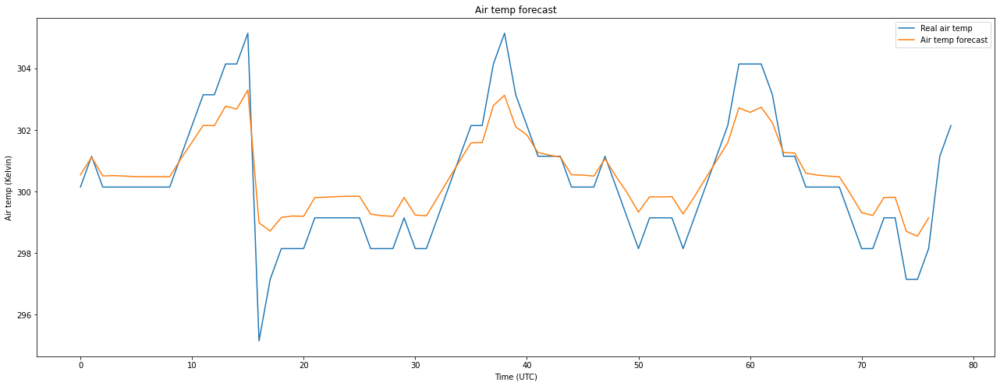

## Results

    

## NOAA dataset
https://psl.noaa.gov/cgi-bin/db_search/DBSearch.pl?&Dataset=NCEP/DOE+AMIP-II+Reanalysis+(Reanalysis-2)+Daily+Averages&Variable=Air+Temperature

## Setup
1. create virtualenv `python3 -m venv pythonenv3.8`
1. activate virtualenv `source pythonenv3.8/bin/activate .`
1. install dependencies `pip install -r requirements.txt`
1. create `.env` file following the example `.env.example`
1. run `python manager.py db upgrade`
1. run `flask seed run`
1. run `python wsgi.py`